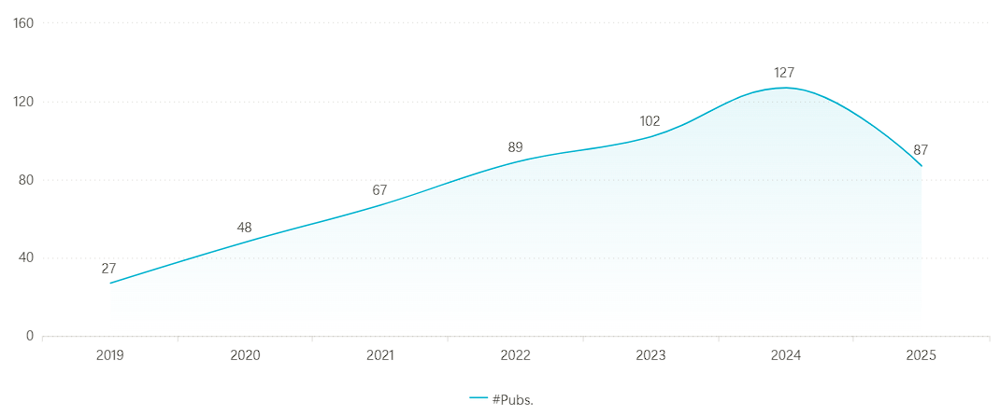

# Awesome_Micro_Gesture [](https://awesome.re)
This is the official repository of `Micro-Gesture Recognition: A Survey of Datasets, Methods, and Challenges`.

> **Taorui Wang**<sup>1,\*</sup>, **Xun Lin**<sup>2,\*</sup>, [Zitong Yu](https://zitong-yu.github.io/yzt/)<sup>2,†</sup>, [Qilang Ye](https://rikeilong.github.io/)<sup>3,4</sup>, [Dan Guo](https://faculty.hfut.edu.cn/gd/en/index.htm)<sup>5</sup>, [Sergio Escalera](https://sergioescalera.com/)<sup>6</sup>, [Ghada Khoriba](https://nu.edu.eg/academic-staff/dr-ghada-khoriba)<sup>7</sup>, [Yong Xu](https://faculty.hitsz.edu.cn/xuyong)<sup>1,†</sup>  

> <sup>1</sup>Harbin Institute of Technology, Shenzhen, China; 
<sup>2</sup>Great Bay University, China; 
<sup>3</sup>Nankai University, China; 
<sup>4</sup>Zhongguancun Academy, China; 
<sup>5</sup>Hefei University of Technology, China; 
<sup>6</sup>Universitat de Barcelona and Computer Vision Center, Spain; 
<sup>7</sup>Center for Informatics Science (CIS), School of Information Technology and Computer Science, Nile University, Egypt.  
> (\*Equal Contribution, †Corresponding Authors)
<h5 align="center">  

 **Paper** | **[ArXiv](https://ArXiv.org/abs/2312.17432)** | **[Github Page](https://github.com/timwang2001/Awesome_Micro_Gesture)**

</h5>


## 📢 News
[07/23/2024]

✨ We've recently released our survey: “Micro-Gesture Recognition: A Survey of Datasets, Methods, and Challenges”!

We present the first comprehensive survey of the Micro-Gesture Recognition. It covers several key aspects: 1) datasets with two diverse modalities and their collection protocols; 2) recognition methods across supervised, unsupervised, contrastive, multimodal fusion, and multimodal large language model (MLLM) paradigms; and 3) challenges such as long-tail distribution, cross-dataset generalization, and bridging recognition with emotion understanding.

The GitHub repository will be gradually updated soon❤️. If there is any problem, feel free to contact us❤️.

## Timeline of MGR method Evolution
As time goes by, the technology of MGR develops more and more rapidly, and more and more articles and methods are published.


## 💎Datasets constructed for MGR

| Date         | Institute | Paper                                                                                                                                                                                   | Publication | Others |
|----------------------|------------------|-----------------------------------------------------------------------------------------------------------------------------------------------------------------------------------------|-------------|--------|
| 2025/04  | LUT             | [DEEMO: De-identity Multimodal Emotion Recognition and Reasoning](https://ArXiv.org/pdf/2504.19549)                                                        | ArXiv       | -      |
| 2024/05 | LUT          | [EALD-MLLM: Emotion Analysis in Long-sequential and De-identity videos with Multi-modal Large Language Model](https://ArXiv.org/abs/2405.00574)                            | ArXiv  | -      |
| 2024/03 | HFUT      | [Benchmarking Micro-action Recognition: Dataset, Methods, and Applications](https://ArXiv.org/abs/2403.05234)                 | TCSVT       | -      |
| 2023/02 | Univ. of Oulu    | [SMG: A Micro-gesture Dataset Towards Spontaneous Body Gestures for Emotional Stress State Analysis](https://link.springer.com/article/10.1007/s11263/023/01761-6)                       | IJCV        | [Github](https://github.com/mikecheninoulu/SMG) |
| 2021/07 | TJU             | [iMiGUE: An Identity-free Video Dataset for Micro-Gesture Understanding and Emotion Analysis](https://ArXiv.org/abs/2107.00285)                                                    | CVPR       | [Github](https://github.com/linuxsino/iMiGUE) |
| 2019/05 | Univ. of Oulu    | [Analyze Spontaneous Gestures for Emotional Stress State Recognition:  A Micro-gesture Dataset and Analysis with Deep Learning](https://ieeexplore.ieee.org/abstract/document/8756513)         | FG          | -      |

## 🔨Methods

| Date    | Institute | Paper                                                                                                                                                                                   | Publication | Others |
|---------|------------------|-----------------------------------------------------------------------------------------------------------------------------------------------------------------------------------------|-------------|--------|
|2025/07| NPU             | [Hybrid-supervised Hypergraph-enhanced Transformer for Micro-gesture Based Emotion Recognition](https://ArXiv.org/pdf/2507.14867)                                                        | ArXiv       | -      |
|2025/07| HFUT | [Online Micro-gesture Recognition Using Data Augmentation and Spatial-Temporal Attention](https://ArXiv.org/abs/2507.09512)| MiGA@IJCAI |-
|2025/06| Goertek          | [DCSNN: An Efficient and High-speed sEMG-based Transient-state Micro-gesture Recognition Method on Wearable Devices](https://dl.acm.org/doi/10.1145/3729494)                            | PACM IMWUT  | -      |
|2025/06|HFUT | [Towards Fine-Grained Emotion Understanding via Skeleton-Based Micro-Gesture Recognition](https://ArXiv.org/abs/2506.12848)|MiGA@IJCAI| [Github](https://github.com/EGO-False-Sleep/Miga25_track1)
|2025/06| Cyrion Labs      | [CLIP-MG: Guiding Semantic Attention with Skeletal Pose Features and RGB Data for Micro-Gesture Recognition on the iMiGUE Dataset](https://www.ArXiv.org/pdf/2506.16385)                 | ArXiv       | -      |
|2025/05| LUT | [Micro-gesture recognition using Mamba](https://lutpub.lut.fi/handle/10024/170090) | ArXiv | - 
|2025/02| HFUT              | [Prototypical Calibrating Ambiguous Samples for Micro-Action Recognition](https://ojs.aaai.org/index.php/AAAI/article/view/32509)                                                                    | AAAI       | [Github](https://github.com/kunli-cs/pcan) |
|2025/02| LUT              | [Identity-free Artificial Emotional Intelligence via Micro-Gesture Understanding](https://ArXiv.org/pdf/2405.13206)                                                                    | ArXiv       | [Github](https://github.com/ErichG/MG-based-Emotion-Understanding) |
|2025/01| UCL              | [MM-Gesture: Towards Precise Micro-Gesture Recognition through Multimodal Fusion](https://ArXiv.org/pdf/2507.08344)                                                                     | MiGA@IJCAI       | [Github](https://github.com/momiji-bit/MM-Gesture) |
|2024/08| HFUT | [Prototype Learning for Micro-gesture Classification](https://ArXiv.org/abs/2408.03097) | MiGA@IJCAI | - |
|2024/07| Univ. of Oulu    | [Naive Data Augmentation Might Be Toxic: Data-Prior Guided Self-Supervised Representation Learning for Micro-Gesture Recognition](https://ieeexplore.ieee.org/document/10581907)         | FG          | -      |
|2024/07| HFUT              | [Micro-gesture Online Recognition using Learnable Query Points](https://ArXiv.org/abs/2407.04490)                                    | MiGA@IJCAI       | -      |
|2024/05| LUT              | [Enhancing Micro Gesture Recognition for Emotion Understanding via Context-Aware Visual-Text Contrastive Learning](https://ArXiv.org/pdf/2405.01885)                                    | ArXiv       | -      |
|2024/01| BUAA             | [BeyondVision: An EMG-driven Micro Hand Gesture Recognition Based on Dynamic Segmentation](https://www.MiGA@IJCAI.org/proceedings/2024/668)                                                    | MiGA@IJCAI       | [Github](https://github.com/tyc333/NoBarriers) |
|2023/07|HFUT |[Joint Skeletal and Semantic Embedding Loss for Micro-gesture Classification](https://ArXiv.org/abs/2307.10624)|ArXiv|-|
|2023/02| Univ. of Oulu    | [SMG: A Micro-gesture Dataset Towards Spontaneous Body Gestures for Emotional Stress State Analysis](https://link.springer.com/article/10.1007/s11263/023/01761-6)                       | IJCV        | [Github](https://github.com/mikecheninoulu/SMG) |
|2022/12| TJU | [CdCLR: Clip-Driven Contrastive Learning for Skeleton-Based Action Recognition](https://ieeexplore.ieee.org/document/10008837)| VCIP | -|
|2022/08| Univ. of Oulu | [Efficient dense-graph convolutional network with inductive prior augmentations for unsupervised micro-gesture recognition](https://ieeexplore.ieee.org/document/9956565/authors#authors) | ICPR |-|
|2021/07| TJU             | [iMiGUE: An Identity-free Video Dataset for Micro-Gesture Understanding and Emotion Analysis](https://ArXiv.org/abs/2107.00285)                                                    | CVPR       | [Github](https://github.com/linuxsino/iMiGUE) |

## ♥️Contributing

We welcome everyone to contribute to this repository and help improve it. You can submit pull requests to add new papers, projects, and helpful materials, or to correct any errors that you may find. Please make sure that your pull requests follow the `"Date|Institute|Paper|Publication|Project link"` format. Thank you for your valuable contributions!

## 🗒️Citation

If you find our survey useful for your research, please cite us:

```bibtex

```
